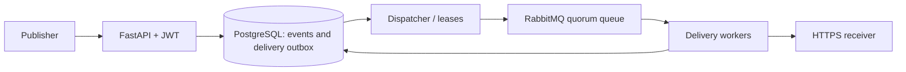

# 11. HookRelay

**Доставка подписанных вебхуков с восстановлением после сбоев.**
Портфолио-проект уровня Middle+ Backend, создан в сентябре 2026 года.

## Возможности

- Пользователи с JWT; до 50 endpoint на аккаунт и подписки по типам событий.
- Стабильный event ID и неизменяемое тело события; идемпотентная публикация.
- Событие и задания доставки создаются одной транзакцией PostgreSQL.
- Долговременное расписание/outbox в PostgreSQL, RabbitMQ с publisher confirms.
- Lease и generation token для восстановления потерянных/устаревших заданий.
- HMAC-SHA256, timestamp, зашифрованные Fernet ключи подписания.
- Ограниченные повторы, экспоненциальная задержка, jitter и Retry-After.
- Журнал попыток, состояния `dead`/`cancelled`, ручная переотправка.
- Проверка публичных DNS-адресов при каждом соединении, HTTPS, запрет редиректов.
- Локальный приёмник с проверкой подписи, дедупликацией и управляемыми сбоями.

## Запуск

```bash
cd ~/Desktop/Python-Backend-Portfolio/11-hookrelay
docker compose up --build -d --wait --wait-timeout 180
docker compose exec -T api python scripts/smoke.py
```

Swagger: <http://localhost:8110/docs>.
Демонстрационный приёмник: <http://localhost:8111/docs>.
Локальный пользователь: `demo@example.com` / `HookRelayDemo123!`.

## API-сценарий

1. `POST /auth/register`, `POST /auth/login` — получить Bearer token.
2. `POST /endpoints` с `url` и `event_types`, например `["order.created"]`.
3. Сохранить `signing_secret`: API возвращает его только при создании endpoint.
4. `POST /events` с `type`, `data` и заголовком `Idempotency-Key`.
5. По `delivery_ids` читать `GET /deliveries/{id}` и историю попыток.
6. После исправления получателя: `POST /deliveries/{id}/replay`.

Клиент не задаёт event ID: сервер создаёт его один раз и сохраняет между
повторами. Несовпадение тела при повторе ключа возвращает `409`.
Размер исходных данных события ограничен 64 KiB.

## Гарантии доставки

Повторы возможны, в том числе после того, как получатель уже выполнил действие.
Получатель должен дедуплицировать по `X-Webhook-Id` в одной транзакции с
бизнес-действием. Демоприёмник именно так и делает. Сервис не заявляет
распределённую exactly-once доставку. После исчерпания бюджета запись остаётся
в `dead` и требует решения оператора. Порядок разных событий не гарантируется.



## Проверки

```bash
make check
make test
make smoke
# Выполняется на хосте; перезапускает только worker/dispatcher этого проекта:
python3 scripts/recovery_smoke.py
```

Live smoke проверяет `503 → 503 → 200`, постоянную ошибку и ручной replay,
а также timeout **после фиксации действия получателем**: два запроса дают одно
бизнес-действие. Recovery smoke принимает событие при остановленных воркерах,
затем убивает worker после commit приёмника и проверяет восстановление lease.

Подробности: [архитектура и безопасность](docs/architecture.md),
[эксплуатация](docs/runbook.md), [проверки](docs/verification.md),
[объяснение для интервью](docs/interview.md).

## Настройки

| Переменная | По умолчанию | Назначение |
|---|---|---|
| `MAX_ATTEMPTS` | 4 | Число попыток в одном цикле, включая прерванные |
| `RETRY_BASE_SECONDS` | 1 | Начальная задержка |
| `LEASE_SECONDS` | 10 | Время восстановления задания, не начатого worker |
| `WORKER_INTERVAL` | 0.5 в Compose | Интервал диспетчера |
| `ENCRYPTION_KEY` | Локальный демо-ключ | Fernet-шифрование ключей подписи |
| `JWT_SECRET` | Локальный демо-ключ | Подпись JWT |

Производственные ключи задаются при развёртывании. Изменение Fernet-ключа
требует перешифрования сохранённых секретов; автоматическая ротация пока не
реализована. Compose допускает HTTP только для точного имени `receiver`.
RabbitMQ — один узел с долговременным томом; кластерная HA не заявляется.

Стек: Python 3.12, FastAPI, SQLAlchemy Core/asyncpg, PostgreSQL 17, RabbitMQ,
aio-pika, aiohttp, cryptography, Alembic, Docker Compose, pytest, Ruff.

## English

HookRelay combines a PostgreSQL delivery outbox with RabbitMQ wakeups,
lease fencing, signed requests and bounded retries. Its failure-injection
receiver demonstrates recovery from ambiguous timeouts and worker crashes
without duplicating the receiver's transactional business effect.
