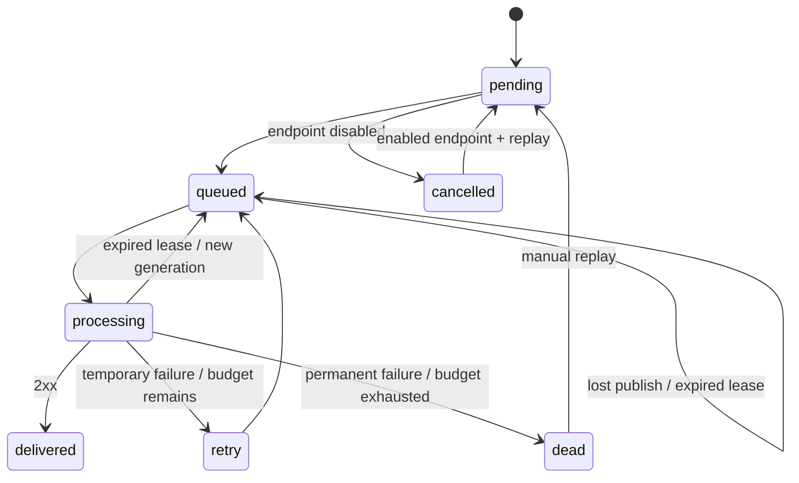

# Архитектура HookRelay

## Почему PostgreSQL остаётся источником истины

`events` содержит неизменяемое сериализованное тело. `deliveries` одновременно
хранит пользовательское состояние доставки и служит долговременным outbox.
Транзакция публикации создаёт обе записи. RabbitMQ переносит только
`{id, generation}`, поэтому потеря уведомления не уничтожает само задание.

Dispatcher выбирает доступные строки через `FOR UPDATE SKIP LOCKED`, создаёт
новый `generation`, устанавливает lease и коммитит. Затем публикует persistent
сообщение с confirms. Сбой между commit и publish восстанавливается по lease.

Worker начинает попытку только для состояния `queued` с совпадающим поколением
и неистёкшей арендой. Он фиксирует `processing`, номер попытки и продлевает lease
на HTTP timeout + 5 секунд. Сетевая операция выполняется вне транзакции.
Результат записывается только при совпадении поколения и статуса; поздний
результат старого worker не может перезаписать новую попытку.

## Сбои и повторы

- `408`, `429`, `5xx`, timeout и сетевые ошибки повторяются в пределах бюджета.
- Остальные HTTP-статусы, включая редиректы, завершают цикл в `dead`.
- `Retry-After` ограничен верхним пределом задержки; тело ответа не сохраняется.
- Падение после успешного HTTP, но до записи результата вызывает повтор.
- Устаревшее сообщение безопасно подтверждается без повторного запуска попытки.
- Бюджет считает и начатые, но прерванные попытки. Их история помечается `lease_expired`.
- Replay сохраняет исходный event ID, payload и общую историю, но начинает новый
  ограниченный цикл попыток. Доставленные события через replay не запускаются.

## Подпись и исходящие запросы

`X-Webhook-Signature = v1=<HMAC-SHA256(secret, timestamp + "." + raw_body)>`.
Приёмник проверяет подпись постоянным по времени сравнением, допускает окно
времени ±300 секунд и связывает ID заголовка с ID тела. Повтор в пределах окна
защищается уникальным event ID в БД приёмника.

Ключи подписи зашифрованы Fernet. Общий ключ шифрования хранится вне БД в
настройках процесса. HTTPS требуется по умолчанию, учётные данные в URL и
редиректы запрещены. DNS resolver проверяет **все** адреса ответа и передаёт
TCPConnector числовые IP; повторного разрешения между проверкой и соединением
нет. DNS cache выключен, соединение не переиспользуется. TLS проверяет исходное
имя хоста. Точное имя `receiver` разрешено в локальном Compose для демонстрации.

## Границы

Доставка at-least-once допускает дубли. Для произвольного внешнего API нельзя
обещать одно бизнес-действие без сотрудничества получателя. Один PostgreSQL и
один RabbitMQ здесь проверяют модель восстановления процессов, а не отказ целого
дата-центра. Есть общая конкурентность worker, но нет гарантии порядка событий
и отдельного распределённого rate limiter для каждого получателя.

Источники: [RabbitMQ reliability](https://www.rabbitmq.com/docs/reliability),
[aiohttp custom resolvers](https://docs.aiohttp.org/en/stable/client_advanced.html).
